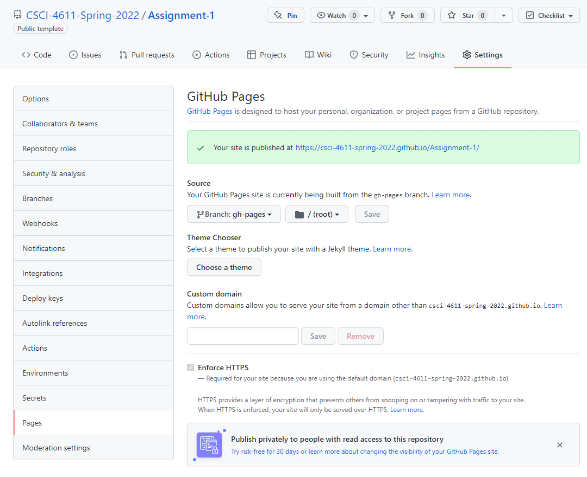

# Assignment 1: Space Minesweeper

**Due: Monday, January 31, 11:59pm CDT**

This assignment involves creating a simple, fun game using 2D graphics. You will learn to:

- Use TypeScript and Node.js for some serious programming
- Work with 2D graphics coordinate systems and primitives
- Animate computer graphics based on user input
- Implement game loops and event handlers

In general, assignments in this class are intended to be implemented in a step-by-step manner.  The rubric below lists all of the features you should implement, starting with the basic functionality and then working up to more advanced features.

You can try a [finished version of the game](https://csci-4611-spring-2022.github.io/Builds/Assignment-1/) in the Builds repository on the course GitHub. This is only a representative example, and you do not need to make your game look or play exactly the same. Your program can have a different look and feel, so long as it satisfies the requirements specified in the rubric.

## Prerequisites

To work with this code, you will first need to install [Node.js](https://nodejs.org/en/) and [Visual Studio Code](https://code.visualstudio.com/). 

## Getting Started

The starter code implements the general structure that we reviewed in lecture.  You set up the initial project by pulling the dependencies from the node package manager with:

```
npm install
```

This will create a `node_modules` folder in your directory and download all the dependencies needed to run the project.  After that, you can compile and run a server with:

```
npm run start
```

You can run the program by pointing your web browser at `http://localhost:8080`.

## Rubric

Graded out of 100 points.

The starter code includes a ship that rotate to point towards the mouse cursor.  First, we are going to make the ship move.  However, we want the ship to always be at the center of the screen.  Instead of moving the ship, we are going to create a bunch of stars that move in the opposite direction, thereby creating the *illusion* of movement. 

1. To achieve this, you should first create a bunch of small circles of varying sizes and place them at random locations within the visible window. 
2. Next, move the stars by a small amount each frame to make the ship appear to move forward.
3. Make the velocity of each star dependent on its size. Smaller stars should appear to move slower than closer stars. This depth effect is known as [parallax](https://en.wikipedia.org/wiki/Parallax).


## Wizards

All of the assignments in the course will include great opportunities for students to go beyond the requirements of the assignment and do cool extra work. However, we do offer a chance to show off… while grading the assignments the TAs will identify the best 4 or 5 examples of people doing cool stuff with computer graphics. We call these students our "wizards," and after each assignment, the students selected as wizards will get a chance to demonstrate their programs to the class!

For this assignment, 

## Submission

When you commit and push your assignment to GitHub, an automated script will build and deploy the production code to the `gh-pages` branch of your repository.  However, your submission is not complete until you do the following:

1. Open your repository on GitHub and go to Settings->Pages.
2. Change the source to the `gh-pages` branch, then save.
3. Wait a couple minutes for the website to deploy.
4. Test your build by pointing your web browser to:
   https://csci-4611-spring-2022.github.io/your-repo-name-here/



If your program runs correctly, then you are finished!  This will indicate to the TAs that your assignment is ready for grading.  If you change your mind and want to make further changes to your code, then just set the GitHub pages source back to `None` and it will unpublish the website.

## License

Material for [CSCI 4611 Spring 2022](https://canvas.umn.edu/courses/290928/assignments/syllabus) by [Evan Suma Rosenberg](https://illusioneering.umn.edu/) is licensed under a [Creative Commons Attribution-NonCommercial-ShareAlike 4.0 International License](http://creativecommons.org/licenses/by-nc-sa/4.0/).